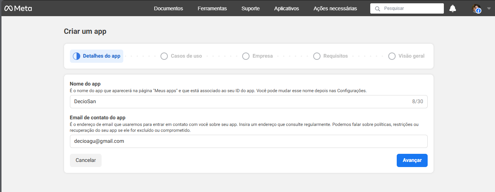

# Aula_Django

- Framework Web Django

- O Django é um framework web em Python de alto nível usado para criar aplicações web de forma rápida, segura e escalável.

**01_Aula_HTML**

- __HTML__ (HyperText Markup Language) ou (Linguagem de Marcação de Hipertexto). 
- É a linguagem base usada para criar páginas e conteúdos na web. O HTML não é uma linguagem de programação, mas sim uma linguagem de marcação. Para adicionar comportamentos (como interações com o usuário), geralmente usamos JavaScript.
    - __Tags__ (etiquetas ou marcação) são palavras-chave envolvidas por sinais de menor "<" e maior ">", em __HTML__ são os elementos usados para marcar e estruturar o conteúdo de uma página. Elas dizem ao navegador como exibir o conteúdo.

    - Exemplo de marcação (tag): 
Olá, mundo!

        - Onde:
            
: é a tag de abertura (parágrafo)
            Olá, mundo!: é o conteúdo entre as tags
            
: é a tag de fechamento
    
    - Resumindo: 
        - HTML → estrutura

- link: https://developer.mozilla.org/pt-BR/docs/Web/HTML
...

**02_Aula_CSS**

- __CSS__ significa (Cascading Style Sheets) ou (Folhas de Estilo em Cascata).
- É a linguagem usada para definir o estilo visual de elementos HTML, como: Cores, fontes, tamanhos, margens e espaçamentos, layouts (posições, colunas, etc). 

    - Pode se aplicar o CSS de três formas:
        - CSS Inline:
            - O estilo é aplicado diretamente no elemento HTML (tag), usando o atributo style.
        - CSS Interno (ou Embutido):
            - O CSS é escrito dentro da própria página HTML, na tag <style> que vai dentro do <head>.
        - CSS Externo:
            - O CSS é escrito em um arquivo separado com a extensão .css, e esse arquivo é link no <head> do HTML usando <link>.

    - Resumindo: 
        - HTML → estrutura
        - CSS → aparência/estilo
...

**03_Aula_JavaScript**

- __JavaScript__ é uma linguagem de programação usada principalmente para criar interatividade em páginas web.
- Enquanto o __HTML__ define a estrutura e o __CSS__ define o estilo, o __JavaScript__ é o que dá vida à página — permitindo que ela reaja a ações do usuário, modifique elementos, valide formulários, se comunique com servidores e muito mais.

    - Resumindo: 
        - HTML → estrutura
        - CSS → aparência/estilo
        - JavaScript → 	Comportamento e interatividade
...

**04_Aula_frameworks**

- Um framework frontend é um conjunto de ferramentas, bibliotecas e regras prontas que ajudam os desenvolvedores a criar a interface visual de um site ou aplicação web (a parte que o usuário vê e interage), sem precisar "reinventar a roda" toda vez.

- link: https://getbootstrap.com.br/
...

**05_Aula_Templates**

- Templates (ou modelos) são estruturas prontas de código usadas para gerar conteúdo dinâmico de forma mais rápida, organizada e reutilizável.
    - Exemplo de uma estrutura HTML já construida.
...

**Aula_06**

- Projeto_01

- Roteiro para criação de projeto Django:
    - Se você quiser que o Django crie uma pasta automaticamente com o projeto dentro, use:
        - django-admin startproject NOME_DA_PASTA
    - Se já está na pasta onde quer o projeto, use:
        - django-admin startproject NOME_DA_PASTA .

- Roteiro para criação de uma aplicação Django:
    - django-admin startapp NOME_DA_APLICAÇÃO

- Iniciar execução do Django dentro da pasta do projeto:
    - python manage.py runserver

-  Arquivo:
    - core:
        - migrations: Nova aplicação
        - __init__.py: Nova aplicação
        - __admin.py__: Nova aplicação
        - __apps.py__: Nova aplicação
        - __models.py__: Nova aplicação
        - __tests.py__: Nova aplicação
        - __views.py__: Nova aplicação
    - projeto:
        - __asgi.py__: Novo projeto
        - __settings.py__: Mudança de idioma para "pr-br" e adição de 'core' em INSTALLED_APPS
        - __urls.py__: Novo projeto
    - __db.sqlite3__: Novo projeto
    - __manage.py__: Novo projeto

- core:
    - migrations:
        - Pasta vazia
    - __init__.py: 
        - Indica que a pasta é um pacote Python
    - __admin.py__: 
        - Configurações para o Django Admin
    - __apps.py__: 
        - Dados de configuração do app
    - __models.py__: 
        - Onde você define os modelos (tabelas do banco)
    - __tests.py__: 
        - Testes automatizados (opcional)
    - __views.py__: 
        - Funções que respondem às requisições (Conexão entre HTML e Banco de Dados)
- projeto:
    - __asgi.py__:
        - É um ponto de entrada para servidores web compatíveis com ASGI (Asynchronous Server Gateway Interface), como o Uvicorn, Daphne ou Hypercorn. Ele é equivalente ao __wsgi.py__, mas voltado para comunicação assíncrona.
    - __settings.py__:F
        - Arquivo responsável pela configuração de banco de dados, segurança, diretórios, apps instalados, idiomas, entre muitos outros ajustes.
    - __urls.py__:
        - Arquivo responsável por definir as rotas do seu site (url).
    - __wsgi.py__:
        - É o ponto de entrada para servidores web compatíveis com WSGI (Web Server Gateway Interface), como o Gunicorn, uWSGI ou mod_wsgi (Apache). Ele serve para inicializar e expor a aplicação Django para o servidor web em ambiente de produção.
- __db.sqlite3__: 
    - Banco de Dados.
- __mannge.py__:
    - Inicia o servidor local de desenvolvimento e gerencia tarefas.
...

**Aula_07**

- Projeto_01

-  Arquivo:
    - core: 
        - __admin.py__: Manipulação de registros no Banco de Dados "Django admin"
        - __models.py__: Modelagem tabela do Banco de Dados
        - __views.py__: Conexão entre Pagina HTML e Banco de Dados (__models.py__)
        - migrations:
            - __0001_initial.py__: Modelagem automática após __models.py__
        - templates:
            - __500.html__: Pagina HTML
            - __400.html__: Pagina HTML
            - __index.html__: Pagina HTML (context de views.py)
            - __produto.html__: Pagina HTML (context de views.py)
            - __contato.html__: Pagina HTML
    - projeto:
        - __settings.py__: Adição de diretório ('DIRS': ['templates']) em TEMPLATES
        - __urls.py__: Adição de rotas requisições __views.py__ para templates (Paginas HTML)

- __0001_initial.py__:
    - Quando você cria ou altera um modelo (por exemplo, adiciona um novo campo em uma tabela) em __models.py__, o Django não aplica essas mudanças diretamente no banco de dados. Em vez disso, ele precisa de um "roteiro" (chamado de migração) que diga exatamente o que deve ser feito.

    - Roteiro para ativação Banco de dados:
        - Após modelagem do Banco de Dados em "__models.py__" aplicar comando para verificar erro: 
            - python manage.py makemigrations

        - Criar a migração, aplica as mudanças no Banco de Dados com:
            - python manage.py migrate

- __admin.py__:
    - Configurar a interface administrativa do Django Admin para manipulação de registros no Banco de Dados. Se você não registrar um modelo no admin.py, ele não aparecerá no painel de administração (/admin).

    - Roteiro para usuário administrador do Banco de dados via Django: 
        -  Criar um usuário administrador (superusuário) do sistema para acesso a rota Django admin:
            - python manage.py createsuperuser
    
    - Usuário e senha cadastrado:
        - http://127.0.0.1:8000/admin/login/?next=/admin/
            - Usuário: decio
            - Senha: dsa

- Iniciar execução do Django dentro da pasta do projeto:
    - python manage.py runserver
...

**Aula_08**

- Projeto_01

- Arquivo:
    - core:
        - static:
            - css:
                - __estilos.css__: Estilo para pagina HTML
            - images:
                - __django.png__: Imagem para pagina HTML
            - js:
                - __script.js__: Programação JavaScript para pagina HTML
        - templates:
            - __500.html__: pagina HTML (exceção personalizado)
            - __400.html__: pagina HTML (exceção personalizado)
            - __index.html__: adição de arquivos pasta static
            - __produto.html__: adição de arquivos pasta static
        - __views.py__: Adição de requisições exceção personalizado (paginas de erro HTML personalizada)
    - projeto:
        - __settings.py__: Redirecionamento de pagina "index.html" e adição de  STATIC_ROOT
        - __urls.py__: Adição de exceção personalização (erro)
    - staticfiles:
        - __*arquivos static__: gerados por "python manage.py collectstatic"

- __settings.py__: 
    - STATIC_ROOT: Caminho onde o Django vai colocar todos os arquivos estáticos coletados de cada app e do diretório STATICFILES_DIRS.

    - Roteiro de ativação:
        - python manage.py collectstatic

    - Será gerado pasta "staticfiles"
    
    - OBS: o  comportamento do Django muda de acordo com DEBUG:
        - Com DEBUG = True: Django serve arquivos estáticos automaticamente durante o desenvolvimento.
        - Com DEBUG = False: Django não serve arquivos estáticos sozinho — você precisa usar collectstatic e configurar um servidor web externo (como Nginx ou Apache) para isso.

- __Publicação no servidor (deploy)__
    - Após finalizar o desenvolvimento de um projeto Django localmente, os próximos passos para publicá-lo em um servidor envolvem preparação, configuração e escolha do ambiente de produção.

- 1. Ajustar configurações para produção
    - No seu arquivo settings.py:

        - DEBUG:
        - Produção nunca deve ter DEBUG = True.
            - DEBUG = False

        - ALLOWED_HOSTS:
        - Inclua o domínio/IP do seu servidor:
            - ALLOWED_HOSTS = ['MEU_DOMÍNIO.com']
        
        - SECRET_KEY:    
        - Use variáveis de ambiente arquivo .env para esconder sua chave.
            - pip install python-decouple

            - arquivo: .env
                - secret_key = SUA_CHAVE

            - arquivo: settings.py
                - from dotenv import load_dotenv 
                - import os           
                - load_dotenv(os.path.join(BASE_DIR, '.env'))
                - SECRET_KEY = os.getenv('secret_key')

            - Adicione ao seu .gitignore:
                - .env

- 2. Criar e configurar o banco de dados de produção
    - Configure no settings.py com variáveis de ambiente:
        - DATABASES = {
                        'default': {
                            'ENGINE': 'django.db.backends.SEU_BANCO_DE_DADOS',
                            'NAME': os.getenv('DB_NAME'),
                            ...
                                    }
                        }

    - Roteiro para ativação Banco de dados:
        - Após modelagem do Banco de Dados em "__models.py__" aplicar comando para verificar erro: 
            - python manage.py makemigrations

        - Criar a migração, aplica as mudanças no Banco de Dados com:
            - python manage.py migrate

    - Roteiro para usuário administrador do Banco de dados via Django: 
        -  Criar um usuário administrador (superusuário) do sistema para acesso a rota Django admin:
            - python manage.py createsuperuser
    
    - Usuário e senha cadastrado:
        - http://127.0.0.1:8000/admin/
            - Usuário: MEU_USUARIO
            - Senha: MINHA_SENHA

- 3. Configurar arquivos estáticos e mídias
    - Publicação de projeto nas redes (deploy)
        - pip install whitenoise

    - WhiteNoise:
        - Função: Serve arquivos estáticos (CSS, JS, imagens etc.) diretamente pelo próprio Django, sem depender de um servidor como o Nginx em produção.
        - Após instalar, você configura no "settings.py" algo como:
            - MIDDLEWARE = [
                'django.middleware.security.SecurityMiddleware',
                'whitenoise.middleware.WhiteNoiseMiddleware',  # logo após SecurityMiddleware
                ...
            ]

        - STATIC_URL = 'static/'
        - STATIC_ROOT = BASE_DIR / 'staticfiles'
        - MEDIA_ROOT = BASE_DIR / 'media'
        - MEDIA_URL = '/media/'
        - STATICFILES_STORAGE = 'whitenoise.storage.CompressedManifestStaticFilesStorage' # gestão dos arquivos estáticos (como CSS, JavaScript e imagens) em produção

    - Roteiro de ativação:
        - python manage.py collectstatic

    - Será gerado pasta "staticfiles"

 - 4. Configurar o servidor WSGI
    - Publicação de projeto nas redes (deploy)
        - pip install gunicorn

    - Gunicorn
        - Função: É um servidor WSGI de produção para aplicações Python.
    
    - Exemplo para rodar localmente (modo produção):
    - NÃO é obrigatório...
        - gunicorn projeto.wsgi:application

- 5. Iniciar execução do Django dentro da pasta do projeto:
    - python manage.py runserver
...

**Aula_09**

- Projeto_02:
    - Iniciar projeto passo a passo Banco de Dados MySQL:

- pip install django whitenoise gunicorn django-bootstrap4 mysqlclient django-stdimage

    - django: Framework web de alto nível para desenvolvimento rápido de aplicações web seguras e escaláveis.

    - whitenoise: Middleware para servir arquivos estáticos diretamente no próprio Django (útil em produção).

    - gunicorn: Servidor HTTP WSGI para aplicações Python (como Django).

    - django-bootstrap4: Biblioteca que facilita a integração do framework Bootstrap 4 com templates do Django.

    - mysqlclient: Driver que permite ao Django (e outros apps Python) se conectar a bancos de dados MySQL/MariaDB.

    - django-stdimage : Extensão do campo ImageField do Django com recursos avançados para imagens.

- Roteiro para criação de projeto e aplicação Django:
    - django-admin startproject projeto_02 .
    - django-admin startapp core 

- Arquivo:
    - projeto:
        - __settings.py__: Variáveis alteradas ALLOWED_HOSTS / INSTALLED_APPS / MIDDLEWARE / TEMPLATES / DATABASES / LANGUAGE_CODE / TIME_ZONE / STATIC_ROOT / STATICFILES_STORAGE
    - __.env__: Variáveis de ambiente (dados sensíveis) 

- Criar Banco de Dados em __MySQL__ em "__Mysql Workbench__":
    - SQL:
        - CREATE DATABASE projeto_02
        - DEFAULT CHARACTER SET utf8
        - DEFAULT COLLATE utf8_general_ci;

- Iniciar execução do Django dentro da pasta do projeto:
    - python manage.py runserver
...

**Aula_10**

- Projeto_02:
    - Configuração de rotas e views para Paginas HTML:
    - Adição de estilo CSS:

Arquivo:
    - core:
        - static:
            - css:
                - __styles.css__: Adição de estilo Paginas HTML
            - images:
            - js:      
        - templates:
            - __index.html__: Pagina HTML (aplicação de estilo __styles.css__ e cotexto __views.py__)
            - __contato.html__: Pagina HTML (aplicação de contexto __views.py__)
            - __produto.html__: Pagina HTML (aplicação de contexto __views.py__)
        - __views.py__: Adição de requisições para templates (Paginas HTML)
    - projeto:
        - __urls.py__: Adição de rotas requisições __views.py__ para templates (Paginas HTML)

- Iniciar execução do Django dentro da pasta do projeto:
    - python manage.py runserver
...

**Aula_11**

- Projeto_02:
    - Modelagem Banco de Dados __models.py__ e __0001_initial.py__:
    - Configurar de interface administrativa do Django Admin __admin.py__:
    - Formulário para Pagina HTML __forms.py__:
    - Conexões das Pagina HTML na aplicações __views.py__:
    - Formulação das Paginas HTML:

Arquivo:
    - core:
        - migrations:
            - __0001_initial.py__: Modelagem automática após __models.py__
        - static:
            - ...
        - templates:
            - __index.html__: Pagina HTML (conexão __arquivos estáticos__ e __views.py__)
            - __contato.html__: Pagina HTML (conexão __arquivos estáticos__ e __views.py__)
            - __produto.html__: Pagina HTML (conexão __arquivos estáticos__ e __views.py__)
        - __admin.py__: Manipulação de registros no Banco de Dados "Django admin"
        - __models.py__: Modelagem tabela do Banco de Dados
        - __forms.py__: Formulário para Pagina HTML de envio automático de e-mail (__models.py__)
        - __views.py__: Conexão entre Pagina HTML e Banco de Dados (__models.py__)
    - projeto:
        - __settings.py__: Variáveis criadas MEDIA_URL / MEDIA_ROOT / LOGOUT_REDIRECT_URL
    

- OBS: __arquivos estáticos__ (static) são quaisquer elementos CSS, JavaScript e imagens ou documentos.

- __0001_initial.py__:
    - Quando você cria ou altera um modelo (por exemplo, adiciona um novo campo em uma tabela) em __models.py__, o Django não aplica essas mudanças diretamente no banco de dados. Em vez disso, ele precisa de um "roteiro" (chamado de migração) que diga exatamente o que deve ser feito.

    - Roteiro para ativação Banco de dados:
        - Após modelagem do Banco de Dados em "__models.py__" aplicar comando para verificar erro: 
            - python manage.py makemigrations

        - Criar a migração, aplica as mudanças no Banco de Dados com:
            - python manage.py migrate

- __admin.py__:
    - Configurar a interface administrativa do Django Admin para manipulação de registros no Banco de Dados. Se você não registrar um modelo no admin.py, ele não aparecerá no painel de administração (/admin).
    
    - Roteiro para usuário administrador do Banco de dados via Django: 
        -  Criar um usuário administrador (superusuário) do sistema para acesso a rota Django admin:
            - python manage.py createsuperuser
    
    - Usuário e senha cadastrado:
        - http://127.0.0.1:8000/admin/login/?next=/admin/
            - Usuário: decio
            - Senha: dsa

- Iniciar execução do Django dentro da pasta do projeto:
    - python manage.py runserver
...

**Aula_12**

- Projeto_02:
    - Envio de e-mail automatizado com Django:

Arquivo:
    - templates:
        - __forms.py__: Aplicação da biblioteca "EmailMessage" envio de e-mail
    - projeto:
        - __settings.py__: Configuração para teste envio de e-mail "EMAIL_BACKEND"

- Iniciar execução do Django dentro da pasta do projeto:
    - python manage.py runserver
...

**Aula_13**

- Projeto_03:
    - Iniciar projeto passo a passo Banco de Dados PostgreSQL:

- pip install django gunicorn  psycopg2-binary django-stdimage dj-static

    - django: Framework web de alto nível para desenvolvimento rápido de aplicações web seguras e escaláveis.

    - gunicorn: Servidor HTTP WSGI para aplicações Python (como Django).

    - psycopg2-binary: Driver de instalação do bancos de dados PostgreSQL.

    - django-stdimage: Extensão do campo ImageField do Django com recursos avançados para imagens.

    - dj-static:  ajuda a servir arquivos estáticos diretamente dentro da aplicação WSGI, usando a biblioteca static do próprio Python.

- Roteiro para criação de projeto e aplicação Django:
    - django-admin startproject projeto_03 .
    - django-admin startapp core 

Arquivo:
    - projeto:
        - __settings.py__: Variáveis alteradas ALLOWED_HOSTS / INSTALLED_APPS /  TEMPLATES / DATABASES / LANGUAGE_CODE / TIME_ZONE | Variáveis criadas MEDIA_URL  / STATIC_ROOT / MEDIA_ROOT / LOGOUT_REDIRECT_URL
    - __.env__: Variáveis de ambiente (dados sensíveis)

- Iniciar execução do Django dentro da pasta do projeto:
    - python manage.py runserver 
...

**Aula_14**

- Projeto_03:
    - Modelagem Banco de Dados __models.py__ e __0001_initial.py__:
    - Configurar de interface administrativa do Django Admin __admin.py__:
    - Conexões das Pagina HTML na aplicações __views.py__ com Class Based Views:
    - Adição de arquivos e pastas: "static" e "templates" de terceiros 

Arquivo:
    - core:
        - static:
            __Observação__
        - templates:
            __Observação__
        - __models.py__: Modelagem tabela do Banco de Dados
        - __admin.py__: Manipulação de registros no Banco de Dados "Django admin"
        - __views.py__: Adição de requisições para templates (Paginas HTML)
        - __core_urls.py__: Adição de rotas requisições __views.py__ para templates (Paginas HTML)     
    - projeto: 
        - __urls.py__: Gerenciamento de rotas das aplicações
        
- __Observação__: As pastas 'static:' e 'templates:' são extraídas de projetos feitos por terceiros

- __0001_initial.py__:
    - Quando você cria ou altera um modelo (por exemplo, adiciona um novo campo em uma tabela) em __models.py__, o Django não aplica essas mudanças diretamente no banco de dados. Em vez disso, ele precisa de um "roteiro" (chamado de migração) que diga exatamente o que deve ser feito.

    - Roteiro para ativação Banco de dados:
        - Após modelagem do Banco de Dados em "__models.py__" aplicar comando para verificar erro:  
            - python manage.py makemigrations

        - Criar a migração, aplica as mudanças no Banco de Dados com:
            - python manage.py migrate

- __admin.py__:
    - Configurar a interface administrativa do Django Admin para manipulação de registros no Banco de Dados. Se você não registrar um modelo no admin.py, ele não aparecerá no painel de administração (/admin).
    
    - Roteiro para usuário administrador do Banco de dados via Django: 
        -  Criar um usuário administrador (superusuário) do sistema para acesso a rota Django admin:
            - python manage.py createsuperuser
    
    - Usuário e senha cadastrado:
        - http://127.0.0.1:8000/admin/login/?next=/admin/
            - Usuário: decio
            - Senha: dsa

- Iniciar execução do Django dentro da pasta do projeto:
    - python manage.py runserver
...

**Aula_15**

- Projeto_03:
    - Conexões das Pagina HTML, Banco de Dados e envio de e-mail na aplicações __views.py__:
    - Envio de e-mail automatizado com formulário em __forms.py__:

- Arquivo:
    - core:
        - __forms.py__: Aplicação da biblioteca "EmailMessage" envio de e-mail automático
        - __views.py__: Conexão entre Pagina HTML, Banco de Dados (__models.py__) e envio de e-mail por formulário (__forms.py__)
    - projeto:
        - __settings.py__: Configuração para teste envio de e-mail automatizado (EMAIL_BACKEND)

- Iniciar execução do Django dentro da pasta do projeto:
    - python manage.py runserver
...

**Aula_16**

- Projeto_03:
    - Teste automatizado Django: 
        
- python manage.py test
    - OBS: Realiza teste em arquivo da aplicação __tests.py__
    - OBS: Teste em Django é somente em ambiente de desenvolvimento: __settings.py__ "DEBUG = True"
    - OBS: Se o projeto Django a ser testado houver Banco de Dados o banco não será afetado

- pip install model_bakery coverage

    - coverage: analisa o código Python durante a execução dos testes e informa quais linhas foram executadas e quais não foram. Ele ajuda a identificar partes do código que ainda não estão cobertas por testes.
        - coverage run manage.py test
            - OBS: será criado arquivo binário ".coverage" apos teste como relatório
            - OBS: caso queira efetuar um conjunto de teste em uma pasta tests, se faz necessario excluir o arquivo teste.py

        - Gerar um relatório no terminal:
            - coverage report

        - Gerar um relatório HTML (visual):
            - coverage html
            - OBS: o uso de "coverage html" gera pasta "htmlcov"
                - Recomendado adicionar pasta "htmlcov/*" em ".gitignore" para proteção de dados

    - model_bakery: é uma biblioteca focada em testes no Django. Ela serve para gerar objetos de modelos automaticamente, preenchendo os campos com dados fictícios válidos, o que facilita a criação de testes unitários.

          # Biblioteca de preenchimento automático
        - from model_bakery import baker

          # Cria 5 objeto do modelo User (sem salvar no banco)
        - user = baker.make('auth.User'_quantity=5)

          # Cria e salva no banco um objeto customizado. Os demais serão preenchidos automaticamente.
        - post = baker.make('app.Post', title='Exemplo de Título', publicado=True)
        
          # Cria também um User automaticamente
        - post = baker.make('blog.Post')

          # fornecer um autor específico:
        - autor = baker.make('auth.User', username='admin')
        - post = baker.make('blog.Post', autor=autor)

          # Inclui campos que não são obrigatórios (opcional):
        - livro = baker.make('biblioteca.Livro', _fill_optional=True)

          # Cria o objeto, mas não salva no banco
        - livro = baker.prepare('biblioteca.Livro')

- Arquivo:
    - core:
        - tests:
            - __test_forms.py__: Teste automatizado
            - __test_models.py__: Teste automatizado
            - __test_views.py__: Teste automatizado
...

**Aula_17**

- djangoum2:
    - Login: User Model Customizado (Django Admin) 

- Arquivo:
    - core:
        - __admin.py__: Manipulação de exibição de dados em Django Admin
        - __models.py__: Personalização de modelo de usuário
    - djangoum2: 
        - __urls.py__: Edição de título pagina Admin HTML
        - __settings.py__: Configurações padrão

- __admin.py__:
    - Configurar a interface administrativa do Django Admin para manipulação de registros no Banco de Dados. 
    
        - Super Usuários do banco:
            - python manage.py createsuperuser
                - Usuário: geek
                - Senha: university

- Iniciar execução do Django dentro da pasta do projeto:
    - python manage.py runserver
...

**Aula_18**

- djangoum3:
    - Login: User Model Customizado (Django Admin)
    - Campo de login por e-mail

- Arquivo:
    - usuarios:
        - __admin.py__: Manipulação de exibição de dados em Django Admin
        - __forms.py__: Formulário de cadastramento de usuário customizado (__models.py__)
        - __models.py__: Modelagem e gerenciador de usuário customizado
    - djangoum3: 
        - __settings.py__: Permisão de customizando de usuário "AUTH_USER_MODEL" (__models.py__)

- Crie seu Super Usuários com:

    - python manage.py createsuperuser
        - E-mail:
        - Primeiro nome:
        - Último nome:
        - Telefone:
        - Password:
        - Password (again):

- Iniciar execução do Django dentro da pasta do projeto:
    - python manage.py runserver
...

**Aula_19**

- djangoum3:
    - Login: User Model Customizado (Django Admin)
    - Criação de nova paguina de login

- Arquivo:
    - usuarios:
    - templates:
        - registraon:
            - __login.thml__: Pagina HTML de login
        - __base.html__: Pagina HTML
        - __index.html__: Pagina HTML
    - djangoum3: 
        - __urls.py__: Nova rota de autenticação
        - __settings.py__: Variáveis criadas LOGIN_REDIRECT_URL / LOGOUT_REDIRECT_URL

- Iniciar execução do Django dentro da pasta do projeto:
    - python manage.py runserver
...

**Aula_20**

- Relacionamento entre modelos (tabelas) de Banco de Dados (__models.py__):
    - Relacionamento um para um
    - Relacionamento um para muitos
    - Relacionamento muitos para muitos
    
- Arquivo:
    - core:
        - __admin.py__: Manipulação de exibição de dados em Django Admin
        - __models.py__: Relacionamento de tabelas no Banco de Dados
    - djangoorm:
        - __settings.py__: Configuração padrão

- Super Usuários do banco:
        - Usuário: geek
        - Senha: university

- Iniciar execução do Django dentro da pasta do projeto:
    - python manage.py runserver
...

**Aula_21**

- Iniciar projeto de comunicação em tempo real (WebSockets) e processos assícrono:

- WebSockets:  é uma tecnologia que permite comunicação bidirecional e em tempo real entre o navegador (frontend) e o servidor (backend) através de uma conexão persistente.

📡  - HTTP tradicional:
        - Cada requisição do cliente abre uma conexão, envia a mensagem, recebe a resposta e fecha a conexão.
        - Exemplo: o usuário envia um formulário → o servidor responde → conexão encerrada.

    - WebSocket:
        - O cliente abre uma conexão e mantém ela aberta. Assim, o servidor pode enviar dados para o cliente a qualquer momento, sem precisar esperar por uma requisição.
        -  É ideal para:
            - Chats em tempo real 💬
            - Notificações instantâneas 🔔
            - Jogos multiplayer 🎮
            - Atualizações em dashboards 

- pip install django  channels  channels-redis daphne

    - django: Framework web de alto nível para desenvolvimento rápido de aplicações web seguras e escaláveis.

    - channels: expande o Django para trabalhar com ASGI (aplicações assíncronas), Django sozinho só aceita HTTP síncrono (com WSGI), Channels é necessário para trabalhar com tempo real e comunicação persistente.

    - channels-redis: funciona como um intermediário para essa troca de multiplas mensagens, auxiliando a biblioteca "django-channels" para permitir que múltiplos processos no Django.

    - daphne: é o servidor padrão recomendado para rodar aplicações Django que utilizam Django Channels, que adiciona suporte a WebSockets e outras funcionalidades assíncronas no Django.

- Roteiro:
    - Criar projeto:
        - django-admin startproject NOME_DO_PROJETO
        - django-admin startproject websocket_project
    - Criar aplicativo:
        - python manage.py startapp NOME_DA_APLICAÇÃO
        - python manage.py startapp chat
    - Aplicar migração de estrutura de banco de dados:
        - python manage.py migrate

- Para rodar  WebSocket com Channels utilize "Daphne": 
    - daphne NOME_DO_PROJETO.asgi:application
    - daphne websocket_project.asgi:application

- Arquivo:
    - chat:
        - templates:
            - __chat.html__: Pagina HTML 
        - __routing.py__: Define as rotas e conexões tratadas por WebSockets (__consumers.py__)
        - __consumers.py__: Élo de ligação entre WebSockets e a aplicação Django
        - __views.py__: Adição de requisições para templates (__chat.html__)
            
    - websocket_project:
        - __asgi.py__: Gerencia rotas e serviços assicrono como Daphne ou Uvicorn (__routing.py__)
        - __settings.py__: Configuração ASGI (aplicações assíncronas)
        - __urls.py__: Rotas da apalicação (__views.py__)
...

**Aula_22**

- Projeto de comunicação em tempo real (WebSockets) e processos assícrono:

- WebSockets:  é uma tecnologia que permite comunicação bidirecional e em tempo real entre o navegador (frontend) e o servidor (backend) através de uma conexão persistente.

- pip install django django-bootstrap4  channels  channels-redis daphne

    - django: Framework web de alto nível para desenvolvimento rápido de aplicações web seguras e escaláveis.

    - django-bootstrap4: Biblioteca que facilita a integração do framework Bootstrap 4 com templates do Django.

    - channels: expande o Django para trabalhar com ASGI (aplicações assíncronas), Django sozinho só aceita HTTP síncrono (com WSGI), Channels é necessário para trabalhar com tempo real e comunicação persistente.

    - channels-redis: funciona como um intermediário para essa troca de multiplas mensagens, auxiliando a biblioteca "django-channels" para permitir que múltiplos processos no Django.

    - daphne: é o servidor padrão recomendado para rodar aplicações Django que utilizam Django Channels, que adiciona suporte a WebSockets e outras funcionalidades assíncronas no Django.

- Roteiro:
    - Criar projeto:
        - django-admin startproject websocket_project
    - Criar aplicativo:
        - python manage.py startapp chat
    - Aplicar migração de estrutura de banco de dados:
        - python manage.py migrate

- Terminal WSL:
    - Atualiza a lista de pacotes:
        - sudo apt update 
    - Instalação simulação de Banco de Dados em memória temporario Redis: 
        - sudo apt install redis-server
    - Iniciar Redis:
        - redis-server
        - Teste Redis:
            - redis-cli ping
                - Resposta "PONG"
        - OBS: Matenha o terminal Linux aberto ao rodar a aplicação.

- Para rodar  WebSocket com Channels utilize "Daphne":
    - daphne realtime.asgi:application

- Arquivo:
    - chat:
        - templates:
            - __index.html__: Pagina HTML
            - __sala.html__: Pagina HTML
        - __views.py__: Adição de requisições para templates (Paginas HTML)
        - __routing.py__: Rotas e conexões tratadas por WebSockets (__consumers.py__)
        - __consumers.py__: Élo de ligação entre WebSockets e a aplicação Django
        - __chat_urls.py__: Rotas da apalicação (__views.py__)
    - realtime:
        - __asgi.py__: Gerencia rotas e serviços assicrono como Daphne ou Uvicorn (__routing.py__)
        - __urls.py__: Gerenciador de rotas das aplicações (__chat_urls.py__)
        - __settings.py__: Configuração ASGI (aplicações assíncronas)   
...

**Aula_23**

- Geolocalização com Django (Mapas):

- pip install django geoip2 requests

    - django: Framework web de alto nível para desenvolvimento rápido de aplicações web seguras e escaláveis.

    - geoip2: Permite obter a localização geográfica de um endereço IP (cidade, país, latitude/longitude).

    - requests: Fazer requisições HTTP (GET, POST, PUT, DELETE) em formato JSON.

- Baixar GeoLite2.mmdb:
    - Pagina:
        - https://dev.maxmind.com/geoip/geolite2-free-geolocation-data/
    - Atanho para arquivos downloads:
        - https://github.com/P3TERX/GeoLite.mmdb

    - Arquivos GeoLite2.mmdb: É um banco de dados binário criado pela MaxMind com dados de geolocalização de endereços IP, ele contém informações como:
    🌐 - País (Brasil, EUA, etc.)
    🏙️ - Cidade (São Paulo, Nova York…)
    📍 - Latitude e longitude
    🕐 - Fuso horário
    📡 - ASN (organização dona do IP, tipo uma operadora)

- Pagina Yelp é uma plataforma online onde pessoas podem pesquisar restaurantes, bares, lojas, serviços e atrações em uma cidade, neste caso é utilizado para alimentar a API Django:
    - https://www.yelp.com.br/rio-de-janeiro

    - Crie um novo App (Create New App):
        - https://www.yelp.com/developers/v3/manage_app

- Arquivo:
    - core:
        - templates:
            - __base.html__: Pagina HTML
            - __index.html__: Pagina HTML
            - __maps.html__: Pagina HTML
        - __utils.py__: Uso de geolocalização (__GeoLite2-City.mmdb__ e __GeoLite2-City.mmdb__) e YELP_API_KEY
        - __views.py__: Requisições para templates (Paginas HTML) e geolocalização (__utils.py__)
        - __core_urls.py__: Rotas da apalicação (__views.py__)
    - geo:
        - __settings.py__: Configuração de Geolocalização
        - __urls.py__: Gerenciador de rotas das aplicações (__core_urls.py__)
    - geoip:
        - __GeoLite2-City.mmdb__: Arquivo binario de geolozalização
        - __GeoLite2-City.mmdb__: Arquivo binario de geolozalização

- Iniciar execução do Django dentro da pasta do projeto:
    - python manage.py runserver
...

**Aula_24**

- Gerar gráficos com Django:

- pip install django django-chartjs django-bootstrap4

    - django: Framework web de alto nível para desenvolvimento rápido de aplicações web seguras e escaláveis.

    - django-chartjs: é um app Django que facilita a inclusão de gráficos interativos no seu projeto usando o Chart.js.

    - django-bootstrap4: Biblioteca que facilita a integração do framework Bootstrap 4 com templates do Django.

- Arquivo:
    - core:
        - templates:
            - __index.html__: Pagina HTML
        - __views.py__: Requisições para templates (Paginas HTML) e gereção de gráficos
        - __core_urls.py__: Rotas da apalicação (__views.py__)
    - charts:
        - __settings.py__: Configuração de Geolocalização
        - __urls.py__: Gerenciador de rotas das aplicações (__core_urls.py__)
    

- Iniciar execução do Django dentro da pasta do projeto:
    - python manage.py runserver
...

**Aula_25**

- Gerar PDF com Django:

- pip install django  reportlab weasyprint

    - django: Framework web de alto nível para desenvolvimento rápido de aplicações web seguras e escaláveis.

    - reportLab: é uma biblioteca Python usada principalmente para gerar arquivos PDF de maneira dinamicamente (não precisa de um modelo pronto).

    - weasyPrint: é usada para gerar PDFs a partir de páginas HTML, diferente do ReportLab que cria tudo do zero.

- Arquivo:
    - core:
        - templates:
            - __index.html__: Pagina HTML
        - __views.py__: Requisições para templates (Paginas HTML) e criar PDF
        - __core_urls.py__: Rotas da apalicação (__views.py__)
    - relatorio:
        - __settings.py__: Configuração de Geolocalização
        - __urls.py__: Gerenciador de rotas das aplicações (__core_urls.py__)

- Iniciar execução do Django dentro da pasta do projeto:
    - python manage.py runserver
---

**Aula_26**

- Aumento de seguraça na aplicação Django:

- Arquivo:
    - seguranca:
        - __settings.py__: Configurações adicionais de segurança

- Iniciar execução do Django dentro da pasta do projeto:
    - python manage.py runserver
---

**Aula_27**

- Login com Facebook aplicação Django:

- pip install django social-auth-app-django django-bootstrap4

    - django: Framework web de alto nível para desenvolvimento rápido de aplicações web seguras e escaláveis.

    - social-auth-app-django: é uma biblioteca para integração de autenticação social no Django. Ela permite que os usuários façam login usando contas de serviços como Google, Facebook, GitHub, Twitter, etc. 

    - django-bootstrap4: Biblioteca que facilita a integração do framework Bootstrap 4 com templates do Django.

- Facebook:
    - Necessario ter uma conta:
    - Área de desenvolvedor:
        - https://developers.facebook.com/apps
            - 
            - [Facebook_02](Aula_27/Facebook.txt)
            - [Facebook_03](Aula_27/Facebook.pdf)

    - OBS: Essa aplicação exige uso de protocolo HTTPS, uma aplicação localhost só executa protocolo HTTP, ou seja, se faz necessário DEPLOY da aplicação em um SERVIDOR para o uso de protocolo HTTPS.
        - HTTP = HyperText Transfer Protocol (Protocolo de Transferência de Hipertexto)
        - HTTPS = HyperText Transfer Protocol Secure (Protocolo de Transferência de Hipertexto Seguro)

- Arquivo:
 - core:
        - static:
            - css:
                - __style.css__: Estilo 
        - templates:
            - __base.html__: Pagina HTML (__style.css__)
            - __index.html__: Pagina HTML
            - __maps.html__: Pagina HTML
        - __views.py__: Requisições para templates (Paginas HTML) 
        - __core_urls.py__: Rotas da apalicação (__views.py__)
    - dsocial:
        - __settings.py__: Configuração midia social
        - __urls.py__: Gerenciador de rotas das aplicações (__core_urls.py__)

- Iniciar execução do Django dentro da pasta do projeto:
    - python manage.py runserver
---

**Aula_28**
 
- CRUD como Function-Based Viewsem Django:

- pip install django django-bootstrap4

    - django: Framework web de alto nível para desenvolvimento rápido de aplicações web seguras e escaláveis.

    - django-bootstrap4: Biblioteca que facilita a integração do framework Bootstrap 4 com templates do Django.

- Arquivo:
 - core:
        - templates:
            - __base.html__: Pagina HTML 
            - __index.html__: Pagina HTML (lista produtos)
            - __produto_form.html__: Pagina HTML (criar e editar produtos)
            - __produto_del.html__: Pagina HTML (deletar produtos)
        - __admin.py__: Manipulação de registros no Banco de Dados "Django admin"
        - __models.py__: Modelagem do Banco de Dados
        - __forms.py__: Formulário de cadastramento (__models.py__)
        - __views.py__: Requisições para templates CRUD (Paginas HTML), uso de (__models.py__)
        - __core_urls.py__: Rotas da apalicação (__views.py__)
    - crudcbv:
        - __settings.py__: Configuração aplicação Django
        - __urls.py__: Gerenciador de rotas das aplicações (__core_urls.py__)

- OBS: Em Function-Based Viewsem é necessario o uso de formulario "forms.py" para criar e processar as "viwes.py"
- __admin.py__:
    - Configurar a interface administrativa do Django Admin para manipulação de registros no Banco de Dados. 
    
        - Super Usuários do banco:
            - python manage.py createsuperuser
                - Usuário: decio
                - Senha: dsa

- Iniciar execução do Django dentro da pasta do projeto:
    - python manage.py runserver
---

**Aula_29**

- CRUD como Class Based Views em Django:

- pip install django django-bootstrap4

    - django: Framework web de alto nível para desenvolvimento rápido de aplicações web seguras e escaláveis.

    - django-bootstrap4: Biblioteca que facilita a integração do framework Bootstrap 4 com templates do Django.

- Arquivo:
 - core:
        - templates:
            - __base.html__: Pagina HTML 
            - __index.html__: Pagina HTML (lista produtos)
            - __produto_form.html__: Pagina HTML (criar e editar produtos)
            - __produto_del.html__: Pagina HTML (deletar produtos)
        - __admin.py__: Manipulação de registros no Banco de Dados "Django admin"
        - __models.py__: Modelagem do Banco de Dados
        - __views.py__: Requisições para templates CRUD (Paginas HTML) 
        - __core_urls.py__: Rotas da apalicação (__views.py__)
    - crudcbv:
        - __settings.py__: Configuração aplicação Django
        - __urls.py__: Gerenciador de rotas das aplicações (__core_urls.py__)

- __admin.py__:
    - Configurar a interface administrativa do Django Admin para manipulação de registros no Banco de Dados. 
    
        - Super Usuários do banco:
            - python manage.py createsuperuser
                - Usuário: decio
                - Senha: dsa

- Iniciar execução do Django dentro da pasta do projeto:
    - python manage.py runserver
---

**Aula_30**

- Paginação de lista de produtos com Function-Based (Função) Viewsem em Django:

- pip install django django-bootstrap4

    - django: Framework web de alto nível para desenvolvimento rápido de aplicações web seguras e escaláveis.

    - django-bootstrap4: Biblioteca que facilita a integração do framework Bootstrap 4 com templates do Django.

- Arquivo:
 - core:
        - templates:
            - __index.html__: Pagina HTML 
            - __paginacao.html__: Pagina HTML
        - __admin.py__: Manipulação de registros no Banco de Dados "Django admin"
        - __models.py__: Modelagem do Banco de Dados
        - __forms.py__: Formulário de cadastramento (__models.py__)
        - __views.py__: Requisições para templates (Paginas HTML) 
        - __core_urls.py__: Rotas da apalicação (__views.py__)
    - dpag:
        - __settings.py__: Configuração aplicação Django
        - __urls.py__: Gerenciador de rotas das aplicações (__core_urls.py__)

- __admin.py__:
    - Configurar a interface administrativa do Django Admin para manipulação de registros no Banco de Dados. 
    
        - Super Usuários do banco:
            - python manage.py createsuperuser
                - Usuário: decio
                - Senha: dsa

- Iniciar execução do Django dentro da pasta do projeto:
    - python manage.py runserver
---

**Aula_31**

- Paginação de lista de produtos com Class-Based (Classe) Views em Django:

- pip install django django-bootstrap4

    - django: Framework web de alto nível para desenvolvimento rápido de aplicações web seguras e escaláveis.

    - django-bootstrap4: Biblioteca que facilita a integração do framework Bootstrap 4 com templates do Django.

- Arquivo:
 - core:
        - templates:
            - __index.html__: Pagina HTML 
            - __paginacao.html__: Pagina HTML
        - __admin.py__: Manipulação de registros no Banco de Dados "Django admin"
        - __models.py__: Modelagem do Banco de Dados
        - __views.py__: Requisições para templates (Paginas HTML) 
        - __core_urls.py__: Rotas da apalicação (__views.py__)
    - dpag:
        - __settings.py__: Configuração aplicação Django
        - __urls.py__: Gerenciador de rotas das aplicações (__core_urls.py__)

- __admin.py__:
    - Configurar a interface administrativa do Django Admin para manipulação de registros no Banco de Dados. 
    
        - Super Usuários do banco:
            - python manage.py createsuperuser
                - Usuário: decio
                - Senha: dsa

- Iniciar execução do Django dentro da pasta do projeto:
    - python manage.py runserver
---

**Aula_32**

- Customizar django/admin:

- Arquivo:
    - dpag:
        - __settings.py__: customizar django/admin
        - __urls.py__: customizar django/admin

- Super Usuários do banco:
            - python manage.py createsuperuser
                - Usuário: decio
                - Senha: dsa
---

**Aula_33 e Aula_34**
- Acesso de banco de dados já existente em MySQL:

- pip install django mysqlclient

    - django: Framework web de alto nível para desenvolvimento rápido de aplicações web seguras e escaláveis.

    - mysqlclient: Driver que permite ao Django (e outros apps Python) se conectar a bancos de dados MySQL/MariaDB.

- OBS para linux:
    - sudo apt-get install python3-dev defult-libmysqlclient-dev -y

- Configure o __settings.py__ conforme o banco de dados desejado.

- Gerar automaticamente modelos (models.py):
    - python manage.py inspectdb
        - Cole os dados em __models.py__ para ativação Banco de dados:
    **OU**
    - python manage.py inspectdb > PASTA/models.py
        - modelagem é escrita ditera para o arquivo.

- Após modelagem do Banco de Dados em "__models.py__" aplicar comando paraverificar erro: 
    - python manage.py makemigrations

- Criar a migração, aplica as mudanças no Banco de Dados com:
    - python manage.py migrate

- Configure o __admin.py__ para manipulação dos dados existente no Banco de Daos em Django Admin.

- Roteiro para usuário administrador do Banco de dados via Django: 
        -  Criar um usuário administrador (superusuário) do sistema para acesso a rota Django admin:
            - python manage.py createsuperuser
    
    - Usuário e senha cadastrado:
        - http://127.0.0.1:8000/admin/login/?next=/admin/
            - Usuário: decio
            - Senha: dsa

- Iniciar execução do Django dentro da pasta do projeto:
    - python manage.py runserver
---
